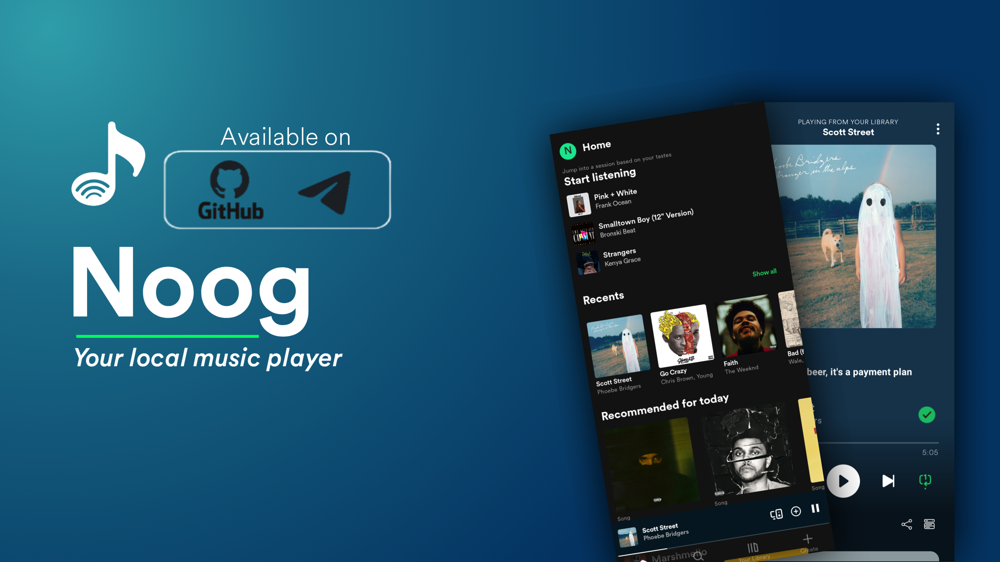

# Noog-Local-Music-Player

Noog is a Spotify-like local music player for Android, built with Jetpack Compose and Media3. It is made for smooth playback, animated canvas-style covers, and a clean, modern listening experience..

⚠ NB. The app is still in development, so you may run into bugs, missing features, or a few stability issues.

## Preview

<table width="100%">
  <tr>
    <td align="center"></td>
    <td align="center"></td>
    <td align="center"></td>
  </tr>
  <tr>
    <td align="center"></td>
    <td align="center"></td>
    <td align="center"></td>
  </tr>
</table>
