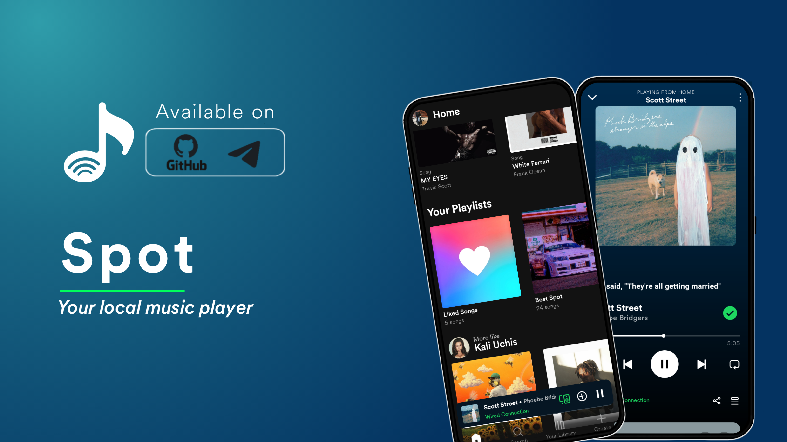
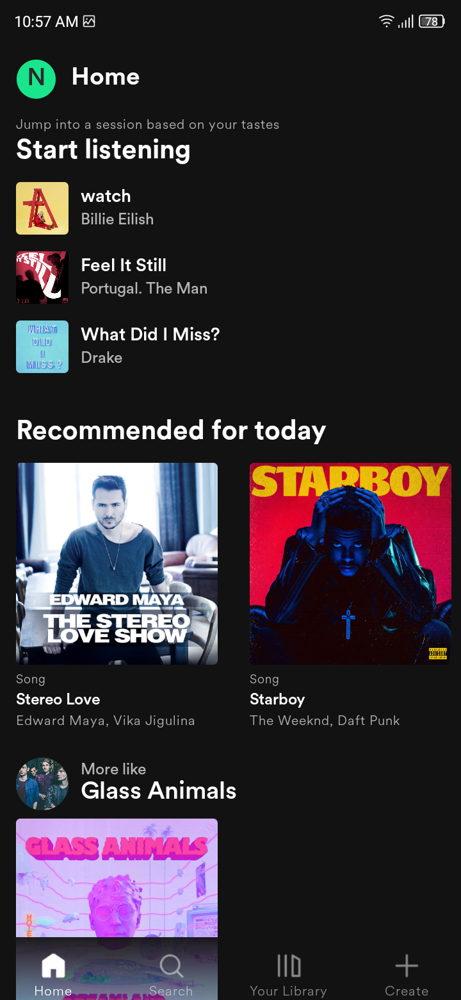
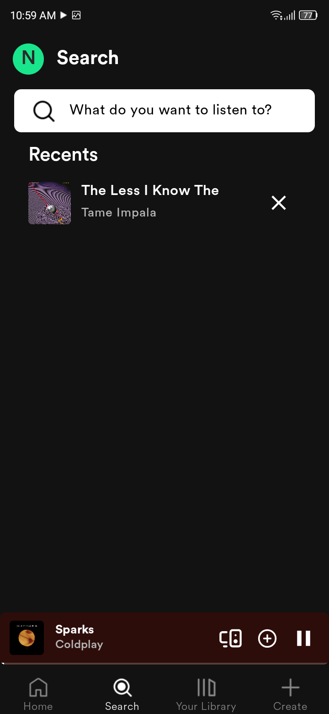
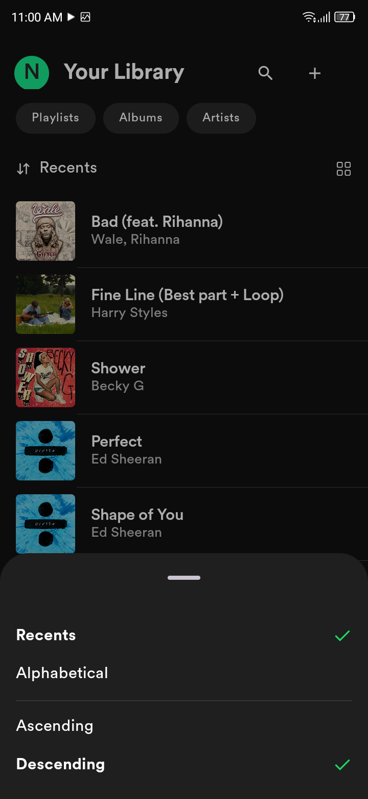
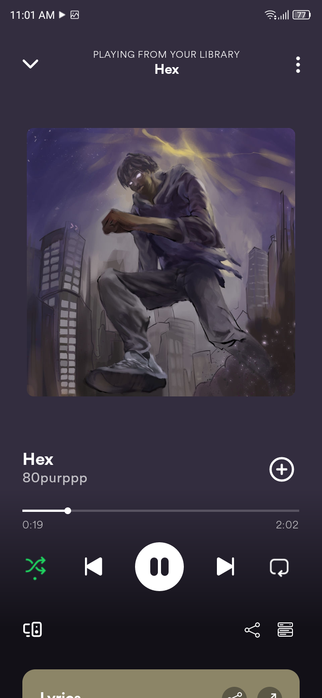
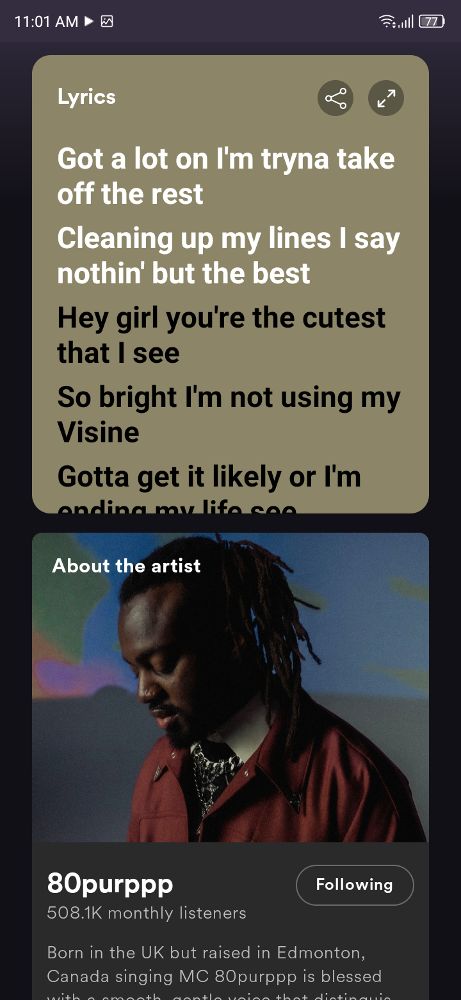
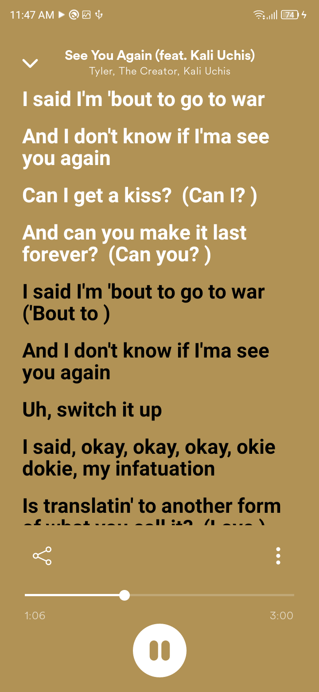
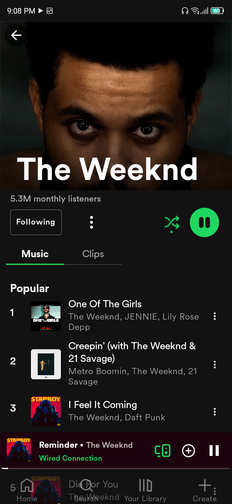
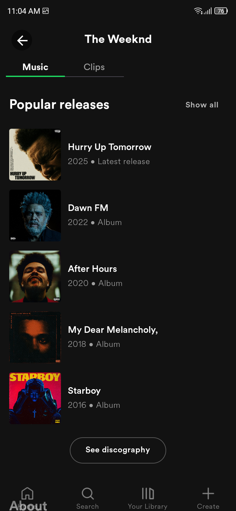
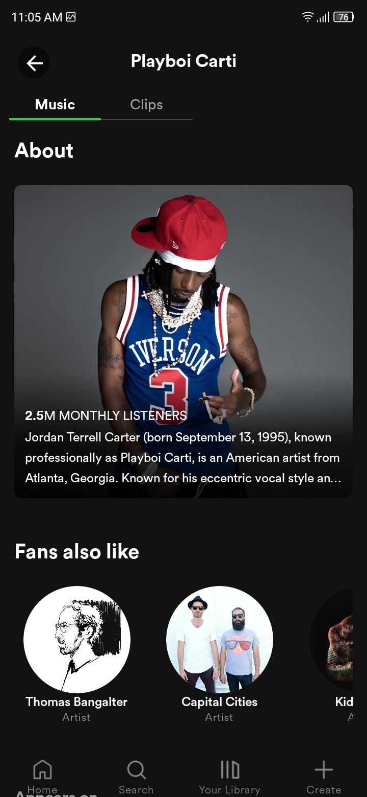

# Spot The Difference
### The best [Spot](t.me/spot_music_player) for your local music.

Spot is a Spotify-like local music player for Android, built with Jetpack Compose and Media3. It is made for smooth playback, animated canvas-style covers, and a clean, modern listening experience.

⚠ NB. The app is still in development, so you may run into bugs, missing features, or a few stability issues.

  
 <b>Preview</b>

  
  Overall
  Home Screen
  Search Screen
  Your Library Screen
  Settings Screen
  Liked Songs Screen
  Playlist Screen
  Album Screen
  Artist Screen

# Preview

<table width="100%">
  <tr>
    <td align="center"></td>
    <td align="center"></td>
    <td align="center"></td>
  </tr>
  <tr>
    <td align="center"></td>
    <td align="center"></td>
    <td align="center"></td>
  </tr>
  <tr>
    <td align="center"></td>
    <td align="center"></td>
    <td align="center"></td>
  </tr>
</table>

# Basics

### Technical Information
- Developed with Jetpack Compose
- Powered by Media3 / ExoPlayer
- Minimum support for Android 7.0+
### Package Information
- Lightweight local music player
- Fully local playback support
- Internet connection required to fetch artist images and biography
- Requests only the permissions needed for music playback and library access
### Feature Information
- Clean and modern now playing screen
- Canvas-style animated covers
- Lyrics preview
- Playback settings and customization
- Crossfade and audio focus support
- Mini player support
- Fast library scanning
- Smooth UI animations

## Key Features

### Local Music Playback
Noog is built for local music files on your device. It focuses on fast playback, smooth transitions, and a simple user experience.

### Canvas-Style Animated Covers
Spot supports animated cover art for a more dynamic now playing experience. It can display webp and mp4-based canvas-style visuals when available. To view the instructions on how to use the canvas feature, [click here](https://t.me/spot_local_music/400).

### Lyrics Preview
Spot includes a lyrics preview area for a richer listening experience, with a Spotify-style presentation.

### Playback Customization
Spot includes playback options such as:
- Audio focus
- Crossfade
- Automatic crossfade mode
- Manual crossfade control

### Modern UI
Spot uses a clean Jetpack Compose interface with smooth animations, dark styling, and a compact mini player.

## Download the app
You can get the latest version of Noog from GitHub [Releases](https://github.com/yosephendale722/Noog-YE/releases) or through our [Telegram](https://t.me/spot_music_player) channel.

## About

Spot is developed by [Yoseph Endale](https://github.com/yosephendale722).
